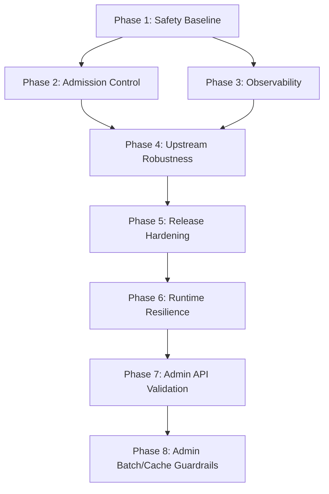

最后更新：2026-07-06 08:19

# Dependency Graph

```mermaid
graph TD
  P1["Phase 1: Safety Baseline"] --> P2["Phase 2: Admission Control"]
  P1 --> P3["Phase 3: Observability"]
  P2 --> P4["Phase 4: Upstream Robustness"]
  P3 --> P4
  P4 --> P5["Phase 5: Release Hardening"]
  P5 --> P6["Phase 6: Runtime Resilience"]
  P6 --> P7["Phase 7: Admin API Validation"]
  P7 --> P8["Phase 8: Admin Batch/Cache Guardrails"]
```
